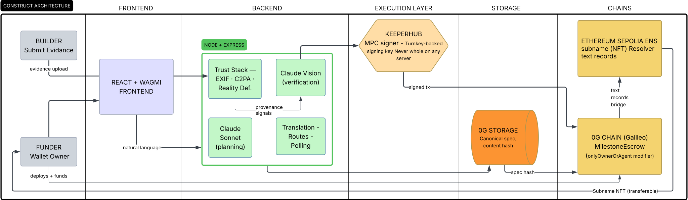

**Autonomous construction escrow agent.** Plans projects, verifies evidence, releases payments, and survives the company that started it.

🏆 _ETHGlobal Open Agents 2026 — submitted to 0G Autonomous Agents, KeeperHub, and ENS._

> _"It's easy to raise £100m for a project overseas. What's difficult is making sure all that money goes where it's supposed to."_
> — Chris Steel, Rotary International

---

## What it does

A funder writes a project description in any language. An agent breaks it into milestones with machine-verifiable acceptance criteria. Money locks in escrow on 0G. The project is minted as an ENS subname on Sepolia. A builder uploads evidence. A four-layer Trust Stack checks the evidence is real. Claude Vision checks the evidence matches the criteria. An MPC wallet — whose key doesn't fully exist on any server — releases payment on 0G and updates the project state on Sepolia in the same flow. If something looks wrong, it escalates. **If the company building it goes bust, the project transfers as an NFT and the new wallet inherits the work.**

---

## The pipeline

Five phases. Every layer is on-chain, decentralised, or independently verifiable.

| Phase           | What happens                                                                                                                       | Where                    |
| --------------- | ---------------------------------------------------------------------------------------------------------------------------------- | ------------------------ |
| **1. Describe** | Funder writes the project in any of six languages                                                                                  | Frontend                 |
| **2. Plan**     | Claude Sonnet generates milestones with structured `evidence_type`, `evidence_instruction`, `verification_confidence`              | Backend → Claude API     |
| **3. Deploy**   | Funder's wallet deploys + funds `MilestoneEscrow.sol` in one transaction. Spec pinned to 0G Storage. ENS subname minted on Sepolia | 0G Chain + Sepolia       |
| **4. Verify**   | Builder uploads evidence. Trust Stack runs (EXIF, C2PA, Reality Defender, pricing oracle). Claude Vision checks criteria           | Backend                  |
| **5. Release**  | On approval, KeeperHub-routed MPC wallet signs payment release on 0G and updates ENS state on Sepolia. Same identity, two chains   | KeeperHub + 0G + Sepolia |

If a builder folds mid-project, a sixth flow takes over: **the funder transfers the ENS NFT to a new wallet. The new owner clicks "Load Existing Project," sees the remaining milestones with full history intact, deploys a fresh escrow, and continues.** Same NFT, new escrow, full audit trail.

## 

## Why Construct is different

Three problems every other autonomous-payment project hand-waves. Three answers I actually built.

### 🧠 Planning

**Machine-readable acceptance criteria, in any language.** Every milestone has a structured `evidence_type`, a specific `evidence_instruction`, and a `verification_confidence` threshold. The funder writes it in whatever language their ground team speaks; the agent enforces it literally. _"Receipt from Mombasa Hardware Store for $1,500 or less, dated within the next 7 days"_ means exactly that. Wrong store, denied. Over budget, denied.

Six languages live: English, Ukrainian, Arabic, Spanish, French, Swahili.

### 🛡️ Provenance

**The Trust Stack. Layered defence against fake evidence.** Before any AI judges whether the work is done, we check if the evidence is _real_. Camera metadata (EXIF), C2PA content credentials, Reality Defender's AI-generation probability, and a Claude-driven pricing oracle. Four independent signals feeding one trust verdict. Fraud becomes expensive and detectable, not theoretically preventable.

| Layer                          | Catches                                                        | Misses                                                                |
| ------------------------------ | -------------------------------------------------------------- | --------------------------------------------------------------------- |
| **EXIF** (`exifr`)             | Screenshots, fully AI-generated images, editing fingerprints   | GPS strips from share sheets, EXIF preserved by some AI editing tools |
| **C2PA** (`@trustnxt/c2pa-ts`) | Any post-capture modification if device signed the original    | ~99.9% of current images have no manifest, adoption is early          |
| **Reality Defender**           | Fully AI-generated images (~93% confidence on test fakes)      | Localised AI edits on real photographs                                |
| **Pricing Oracle** (Claude)    | Price inflation, material substitution, implausible quantities | Prices within normal variation bands                                  |

Each layer's failure modes are documented. A fraudster has to beat all four to produce approved evidence.

### 🤝 Continuity

**Cryptographically signed handover. The project survives the company.** Each project is an ENS subname owned by the funder. When a builder fails, the funder transfers the NFT. The receiving wallet sees the project with full history — completed milestones, payments made, original spec — recovered from on-chain state and 0G Storage. They deploy a fresh escrow, repoint the same NFT at it, and continue. _One project, one NFT, all the way through, no matter how many companies it passes through._

The autonomous agent keeps signing across the chain split. KeeperHub's MPC wallet signs escrow on 0G **and** identity on Sepolia. One agent, two chains, no custody.

---

## Architecture

Every layer decentralised or independently verifiable. One coherent pipeline.


| Surface      | Component                          | Decentralisation property                                    |
| ------------ | ---------------------------------- | ------------------------------------------------------------ |
| Identity     | ENS subname (Sepolia, NameWrapper) | NFT ownership transferable; text records portable            |
| Settlement   | `MilestoneEscrow.sol` (0G Galileo) | Funds locked on-chain; release gated by `onlyOwnerOrAgent`   |
| Storage      | 0G Storage (content-addressed)     | Spec pinned with content hash embedded in escrow contract    |
| Custody      | KeeperHub + Turnkey MPC wallet     | Signing key split across parties — never whole on any server |
| Planning     | Claude Sonnet via tool-use         | Schema-constrained outputs, full prompt logged               |
| Verification | Claude Vision + Trust Stack        | Structured verdict, all reasoning preserved on-chain via tx  |

Full deep-dive in [`docs/ARCHITECTURE.md`](docs/ARCHITECTURE.md).

---

## Tech stack

| Layer                 | Choice                                                     |
| --------------------- | ---------------------------------------------------------- |
| Smart contracts       | Solidity 0.8.20, Hardhat, OpenZeppelin                     |
| Backend               | Node.js, Express, ethers v6, viem                          |
| Frontend              | React 19, TypeScript, Vite, Tailwind, wagmi v2, RainbowKit |
| Settlement chain      | 0G Galileo Testnet (chainId 16602)                         |
| Identity chain        | Ethereum Sepolia (chainId 11155111)                        |
| Decentralised storage | 0G Storage (`@0gfoundation/0g-ts-sdk` v1.2.1)              |
| AI planning           | Claude Sonnet (Anthropic API, tool-use)                    |
| AI verification       | Claude Vision (Anthropic API, tool-use)                    |
| AI detection          | Reality Defender (`@realitydefender/realitydefender`)      |
| Content credentials   | C2PA (`@trustnxt/c2pa-ts`)                                 |
| EXIF                  | `exifr`                                                    |
| MPC custody           | Turnkey, routed via self-hosted KeeperHub                  |

---

## Run it locally

### Prerequisites

- Node.js ≥ 25
- npm with `legacy-peer-deps` set
- An Ethereum wallet with Sepolia ETH and 0G OG (testnet faucets):
  - 0G Galileo: https://faucet.0g.ai
  - Sepolia: https://sepoliafaucet.com
- A Claude API key (https://console.anthropic.com)
- A WalletConnect project ID (https://cloud.walletconnect.com)
- A self-hosted KeeperHub instance with the Turnkey MPC wallet configured _(optional — falls back to server-wallet path if absent)_

### Setup

```bash
git clone https://github.com/<yourname>/construct.git
cd construct

# Backend
cd backend
cp .env.example .env   # fill in your keys
npm install --legacy-peer-deps
npm run dev            # runs on http://localhost:3001

# Frontend (in a second terminal)
cd ../frontend
cp .env.example .env
npm install --legacy-peer-deps
npm run dev            # runs on http://localhost:5173
```

### Environment variables

#### `backend/.env`

| Variable                     | Required  | Description                                                 |
| ---------------------------- | --------- | ----------------------------------------------------------- |
| `ANTHROPIC_API_KEY`          | ✅        | Claude API key                                              |
| `OG_CHAIN_RPC_URL`           | ✅        | `https://evmrpc-testnet.0g.ai`                              |
| `OG_STORAGE_INDEXER`         | ✅        | `https://indexer-storage-testnet-turbo.0g.ai`               |
| `DEPLOYER_PRIVATE_KEY`       | ✅        | Server wallet — fallback agent and 0G Storage upload signer |
| `SEPOLIA_RPC_URL`            | ✅        | Alchemy or Infura Sepolia endpoint                          |
| `KEEPERHUB_AGENT_ADDRESS`    | preferred | Turnkey MPC wallet — used as the contract `_agent`          |
| `KEEPERHUB_WEBHOOK_URL`      | preferred | KeeperHub webhook for `completeMilestone`                   |
| `KEEPERHUB_MINT_SUBNAME_URL` | preferred | KeeperHub webhook for ENS subname mint                      |
| `KEEPERHUB_SET_TEXT_URL`     | preferred | KeeperHub webhook for ENS text records                      |
| `KEEPERHUB_API_KEY`          | preferred | Bearer token for webhook auth                               |
| `REALITY_DEFENDER_API_KEY`   | optional  | Enables AI-generation detection in Trust Stack              |

#### `frontend/.env`

| Variable                        | Required | Description                                |
| ------------------------------- | -------- | ------------------------------------------ |
| `VITE_API_BASE_URL`             | ✅       | Backend URL (`/api` via Vite proxy in dev) |
| `VITE_WALLETCONNECT_PROJECT_ID` | ✅       | WalletConnect Cloud project ID             |

See `.env.example` in each directory for the full list including optional fields.

---

## Project structure

```
construct/
├── contracts/               # Solidity — MilestoneEscrow + tests
│   ├── contracts/
│   ├── scripts/
│   └── hardhat.config.cjs
├── backend/
│   ├── src/
│   │   ├── routes/          # escrow, evidence, projects, handover, translate
│   │   ├── agent/           # Claude planning + vision verification
│   │   ├── trust-stack/     # EXIF, C2PA, Reality Defender, pricing
│   │   ├── storage/         # 0G Storage client + subname registry
│   │   └── keeperhub/       # Webhook clients (0G + Sepolia), ENS helpers
│   └── data/                # subnames.json (project registry — JSON for hackathon)
├── frontend/
│   ├── src/
│   │   ├── components/      # Shutter1Describe, Shutter2Review, Shutter3Verify
│   │   ├── lib/             # api.ts, types.ts, chains, sepolia client
│   │   └── App.tsx          # State machine + cross-chain orchestration
│   └── vite.config.ts
├── docs/
│   ├── ARCHITECTURE.md      # Full system design + decision log
│   ├── DEMO.md              # Judge walkthrough script
│   ├── KEEPERHUB_FEEDBACK.md # Builder Feedback Bounty submission
│   └── AI_ATTRIBUTION.md    # Per ETHGlobal hackathon rules
├── CLAUDE.md                # Repo context for Claude-based coding agents
├── AGENTS.md                # Generic AI coding agent guidance
├── LICENSE
└── README.md
```

---

## Prize-track submissions

**0G Autonomous Agents.** Construct runs the full AI-to-payment pipeline on 0G. Milestones stored on 0G Storage, escrow contracts on 0G Chain, verification triggering release transactions on 0G. The only network in the settlement layer.

**KeeperHub.** An autonomous AI agent executing on-chain payments without anyone holding a custody key. The MPC wallet signs across two chains from a single identity. Self-hosted to add 0G Galileo (the hosted app didn't support at time of build); detailed feedback to the KeeperHub team in [`docs/KEEPERHUB_FEEDBACK.md`](docs/KEEPERHUB_FEEDBACK.md).

**ENS.** Each project is a wrapped ENS subname under `construct.eth`. Text records on the resolver bridge Sepolia identity to 0G escrow state. Transferring the NFT transfers the project, and the same NFT can be repointed at a new escrow when continuity is needed. ENS as a project's spine, not a vanity address.

---

## Two principles

Two threads ran through the entire build.

**1. Production architecture over hackathon shortcuts.** Every workaround that compromises the real product's integrity is a lost opportunity to demonstrate production thinking. _"Every time you say we don't need to think like this for the hackathon is each time we lose."_ No hidden fees, no custody for the agent, no shortcuts on the trust model. The agent fee is shown as a separate line item on the deploy screen because Paxmata exists _because_ construction payments are opaque, and hiding our own fees would contradict the thesis.

**2. Accessibility by design.** Six languages because development finance happens in places that don't speak English. The cross-chain split is invisible to the funder, they see one project, even though it runs across 0G and Sepolia. Wallet connect, error messages, and the spec view all defer to whatever language the user wrote in. The agent reads the language they speak, not the other way round.

---

## Demo

🎥 _Demo video link — added before submission_

---

## Documentation

- [`docs/ARCHITECTURE.md`](docs/ARCHITECTURE.md) — system design, component deep-dives, decision log
- [`docs/DEMO.md`](docs/DEMO.md) — judge walkthrough
- [`docs/KEEPERHUB_FEEDBACK.md`](docs/KEEPERHUB_FEEDBACK.md) — Builder Feedback Bounty
- [`docs/AI_ATTRIBUTION.md`](docs/AI_ATTRIBUTION.md) — Claude usage disclosure (ETHGlobal hackathon rule 3.3)
- [`CLAUDE.md`](CLAUDE.md) — Claude-specific repo guidance for agentic coding sessions
- [`AGENTS.md`](AGENTS.md) — Generic AI coding agent context

---

## What's next

Construct is a hackathon submission. Paxmata is the company behind it. The hackathon proves the architecture works; the company turns it into a product.

Roadmap items deferred from this build:

- **ERC-4337 account abstraction** as the production custody path (not viable on 0G yet — missing EntryPoint and bundler infrastructure)
- **EscrowFactory pattern** to amortise deployment costs across many projects
- **`project_manifest` text record** populated automatically on completion as a long-form audit summary
- **Old escrow refund path** for unspent funds when a project hands over mid-flight
- **Real database** in place of the JSON registry for subname tracking
- **Mainnet ENS** with a registered parent name (currently `construct.eth` on Sepolia)

---

## License

MIT — see [`LICENSE`](LICENSE).

---

_Construct is built by [Alexander Burge](https://github.com/<yourname>) (Founder, Paxmata Ltd). Two takeaways from the build: production architecture pays off, and accessibility is non-negotiable._
